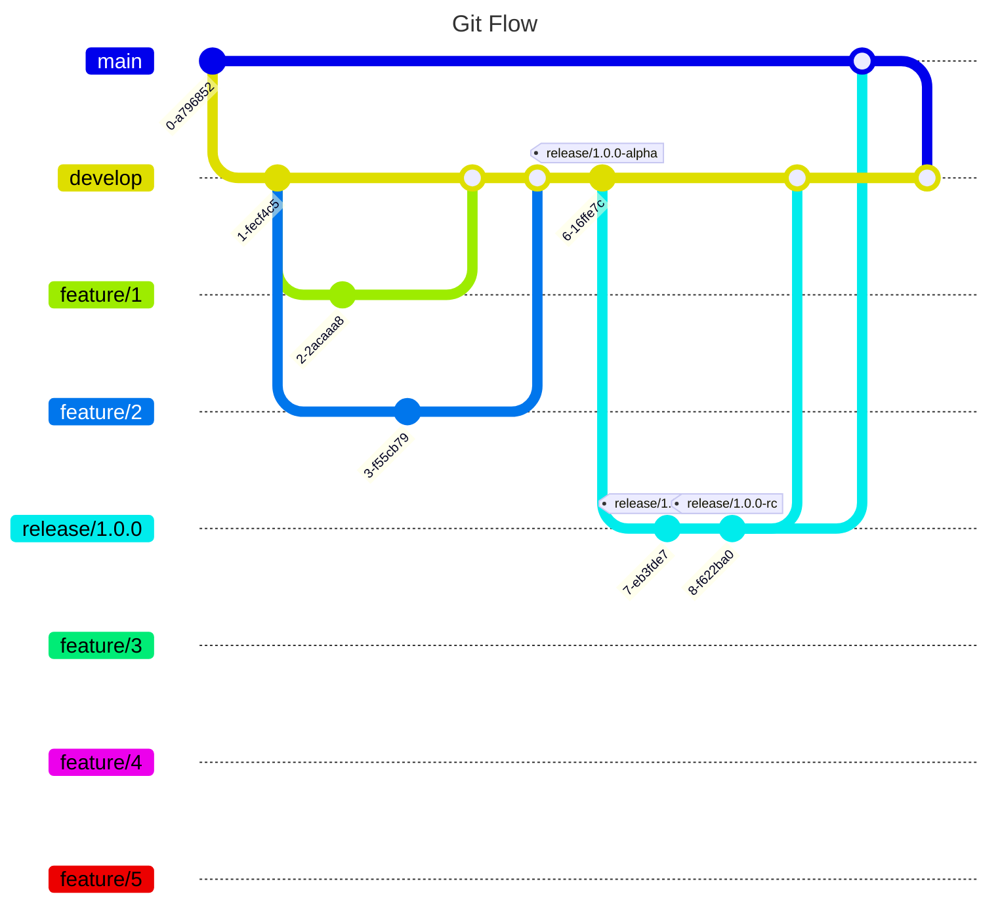

# learn-gitflow

```mermaid
---
title: Git Flow
---

gitGraph

commit
branch develop

commit
branch feature/1
branch feature/2

checkout feature/1
commit

checkout feature/2
commit

checkout develop
merge feature/1
merge feature/2
commit tag:"release/1.0.0-alpha"
branch release/1.0.0
branch feature/3
branch feature/4
branch feature/5

checkout release/1.0.0
commit tag:"release/1.0.0-beta"
commit tag:"release/1.0.0-rc"

checkout develop
merge release/1.0.0

checkout main
merge release/1.0.0

checkout develop
merge main
```
