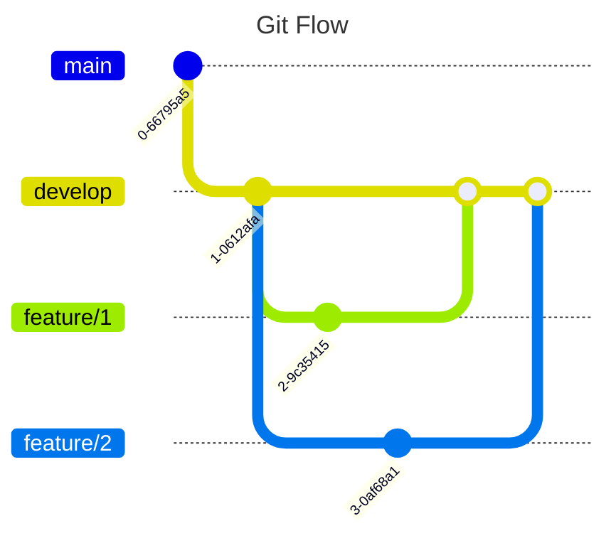

# learn-gitflow

```mermaid
---
title: Git Flow
---

gitGraph

commit
branch develop

commit
branch feature/1
branch feature/2

checkout feature/1
commit

checkout feature/2
commit

checkout develop
merge feature/1
merge feature/2
```
